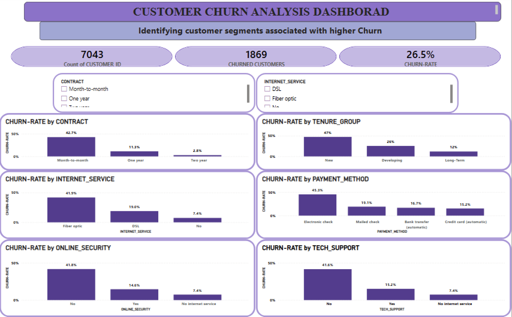
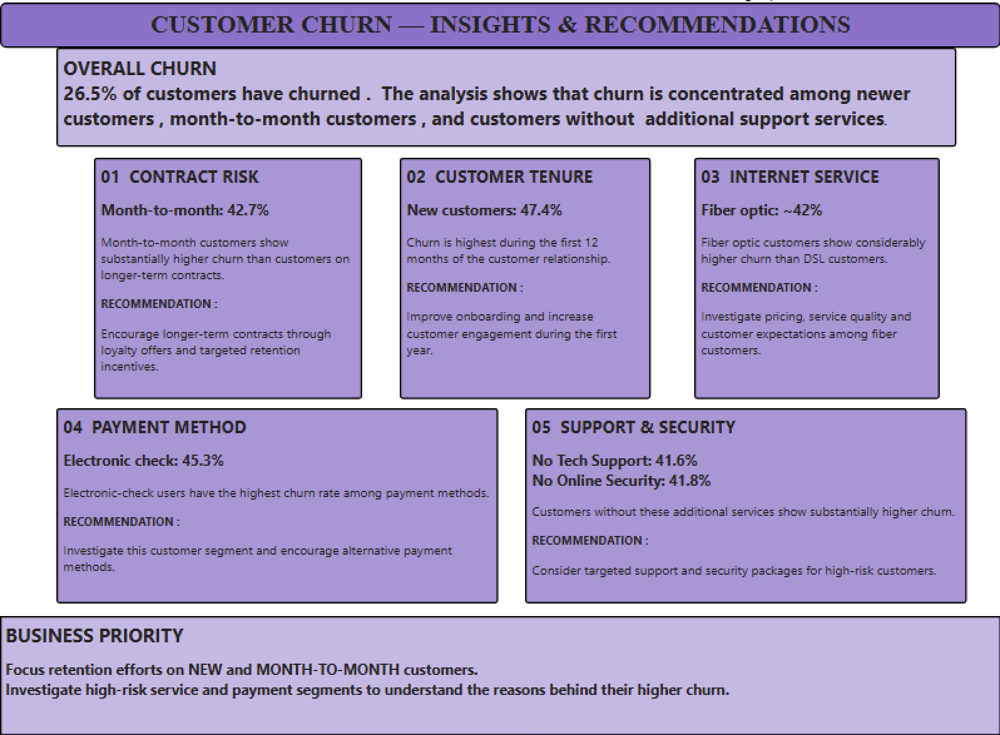

# 📊 Customer Churn Analysis

An end-to-end Data Analytics project using **Python, SQL, and Power BI** to analyze customer churn and identify factors associated with customer retention.

## 🛠️ Tools

- Python (Pandas, Matplotlib)
- SQL (SQLite)
- Power BI
- Git & GitHub

## 📊 Key Results

- **Total Customers:** 7,043
- **Churned Customers:** 1,869
- **Overall Churn Rate:** 26.5%

### Key Findings

- Month-to-month customers have the highest churn.
- New customers have significantly higher churn.
- Fiber optic customers show relatively high churn.
- Electronic check users have the highest churn among payment methods.
- Customers without Tech Support or Online Security show higher churn.

## 📈 Power BI Dashboard

## 💡 Recommendations

- Improve onboarding for new customers.
- Encourage longer-term contracts.
- Investigate issues affecting high-churn customer segments.
- Promote support and security services where appropriate.

## 🚀 Future Improvements
- Customer churn prediction using Machine Learning
- Customer segmentation
- Cohort analysis
- Predictive retention scoring

## 👨‍💻 Author

**Harshawardhan Jori**  
Data Analytics | Python | SQL | Power BI